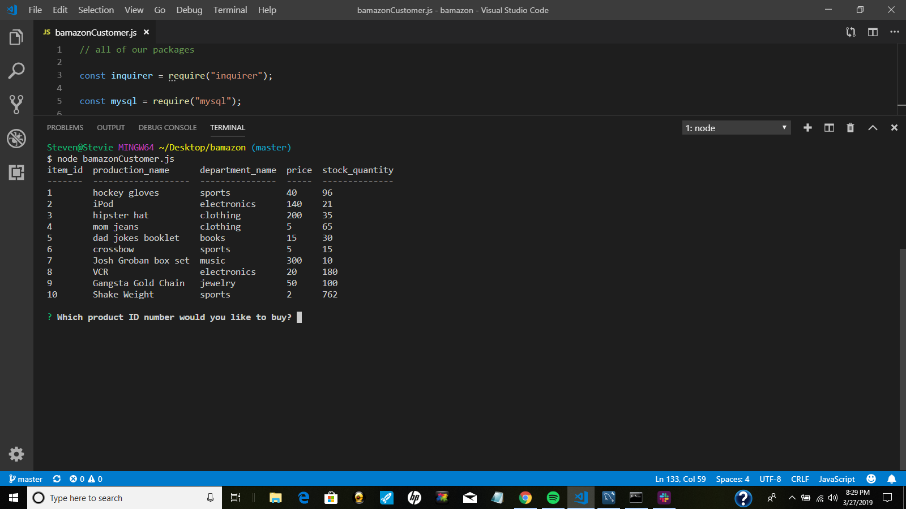
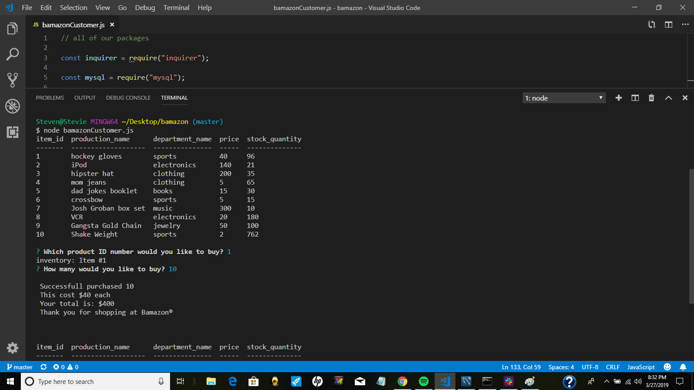
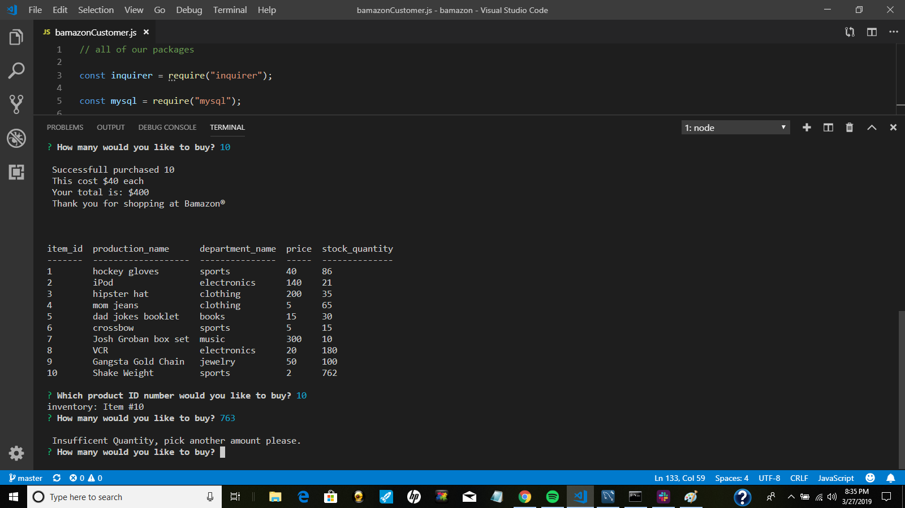
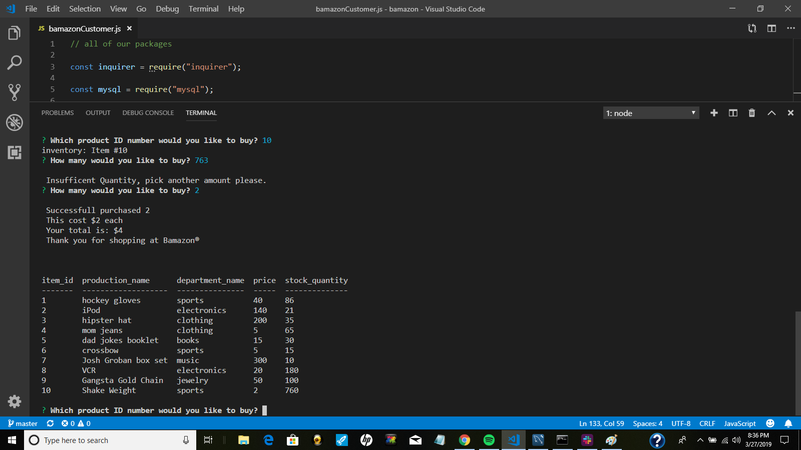
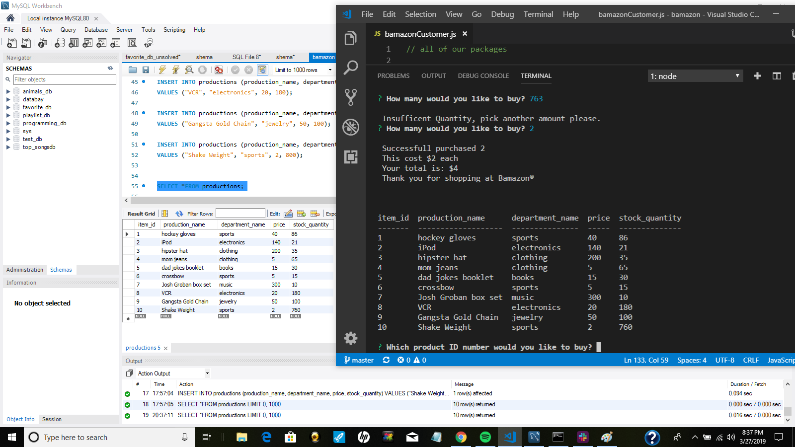
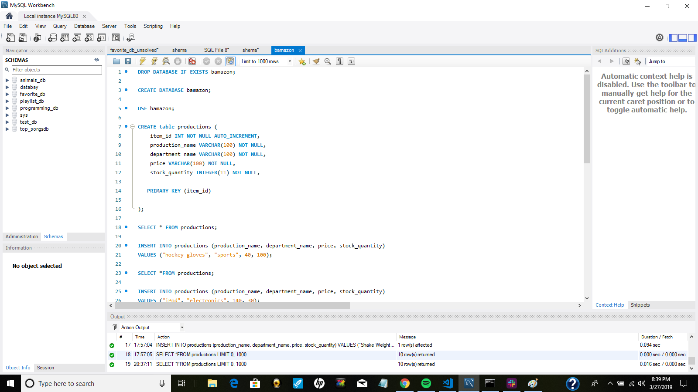

# Bamazon

In this application, I created an Amazon-like storefront with MySQL  called "Bamazon". The app will take in orders from customers and deplete stock from the store's inventory.  I used the SQL language and MySQL workbench to create the table with all of my products.  I then used Node.JS to run the storefront in the terminal in Visual Studio Code. I used three Node.JS packagess.

1. I used the Inquirer package to ask the user questions via prompts in the terminal.

2. The console.table package was used to display the information in a table.

3. The third package was the mysql package which uses JavaScript with Node.js.

# To use the app we first type in the terminal:

 ` "node bamazonCustomer.js" `

 

**Example 1** Here the user has a choice of what they can buy.  They have the item ID, product name, department, price, and stock quantity shown  with a list of 10 items. 

 
 **Example 2** I've selected "hockey gloves" by entering "1." It tells me I've selected that item and stores it in my inventory. The next question is then shown.

  

**Example 3** I've selected "10" as the amount of hockey gloves I wish to purchase. There are "96" hockey gloves in stock. Because of this I can buy them.

  Since "hockey gloves" are $40 and I bought 10. I spent $400. The application automatically runs again. 

# Now look what happens when I pick an item and select a quantity higher than what is available in my stock.

 

**Example 4** In the table above,  I had "96" in my "stock_quantity", but since I bought "10" of "hockey gloves" I now have "86."

I have selected to buy item number 10 which is the "Shake Weight." I tried to buy 763 of them, but their only 762. I get a message that says "Insufficient Quantity."  Because of this I could not buy them and I am asked again to pick a different quantity. The inventory still has 762 "Shake Weights."

**Example 5** I decided to buy "2" of the  "Shake Weight."  The order goes through because I had "762" in my stock inventory. Now their are "760" of them in my inventory.  

**Example 6** Here are the reflections of all the purchases I made.  You can see them  on the right side of the screen in Visual Studio Code.  On the left side of the screen is MySQL Workbench which is where I'm getting the table from. It has the same information displayed.

**Example 7** I created this table as my first step. You can see the amounts of stock inventory I had for "hockey gloves" when I originally created the program. It started out as "100."  I have made several purchases since then. These are how tables are made in mySQL.  If you look at "Insert into" you can see how "hockey gloves" were originally created with the category, price, and stock.  My table is called "productions."